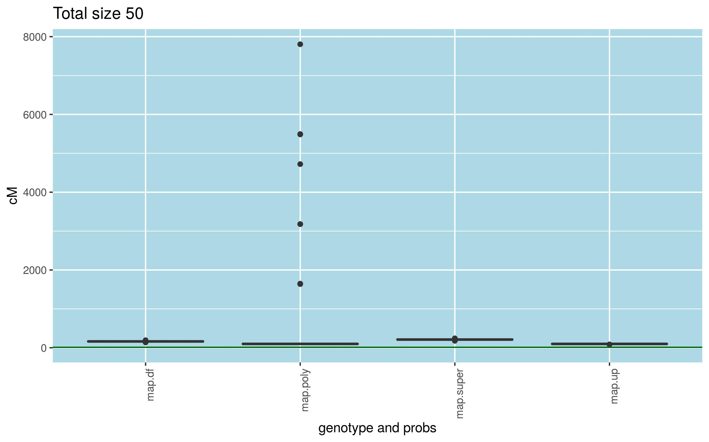
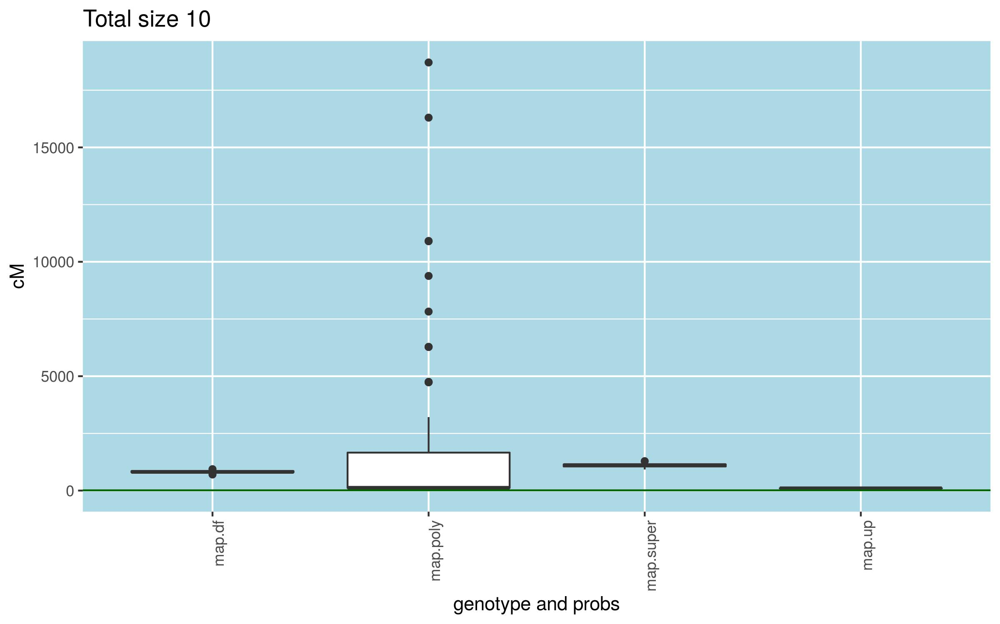
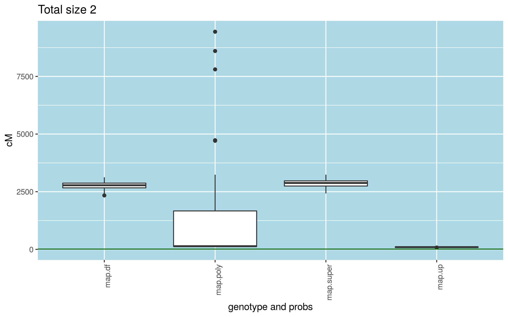
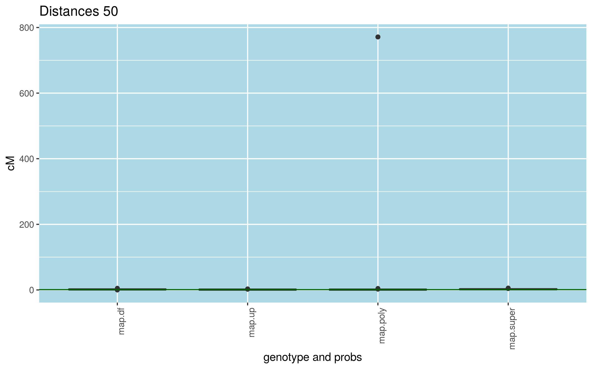
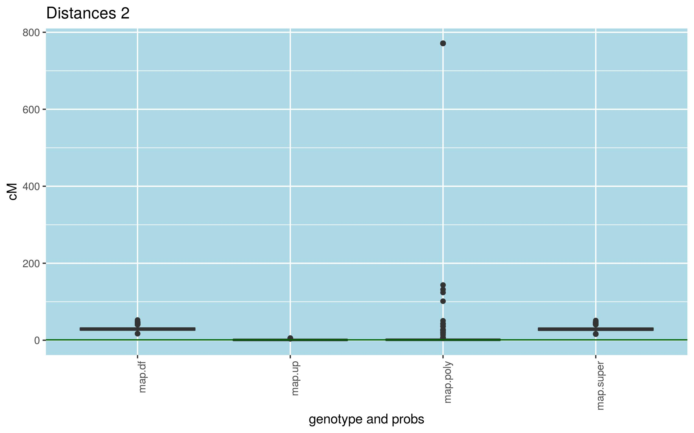

```{r knitr_init, echo=FALSE, cache=FALSE}
library(knitr)
library(rmdformats)

## Global options
options(max.print="75")

opts_knit$set(width=75)
```

# Packages

```{r, warning=FALSE, message=FALSE, eval=FALSE}
library(vcfR)
library(polyRAD)
library(updog)
library(supermassa4onemap)
library(doParallel)
library(onemap)
library(ggplot2)
```

The purpose here is test the code for build maps with genotypes and genotypes probabilities coming from updog, polyRAD and supermassa software.

Allele counts will be simulated using updog model with depth 50, 10 and 2. The progeny have 200 individuals and only one chromossome with 100 cM in size. To not take too much time, only 100 markers will be present. Only biallelic markers will be considered. **adapt code to support other types of markers**

# F2 populations

### Functions

```{r, eval=FALSE}
simulations.f2 <- function(i, mean.depth=50, p.mean.depth=50){
  onemap::run_pedsim(chromosome = c("Chr10"),
                     n.marker = c(100), tot.size.cm = c(100), centromere = c(50),
                     n.ind = 200, mk.types = c("A.H.B"), n.types = c(100),
                     pop = "F2", path.pedsim = "~/Programs/PedigreeSim/",
                     name.mapfile = paste0("mapfile",i,".map"),
                     name.founderfile=paste0("founderfile.",i,".gen"),
                     name.chromfile=paste0("sim",i,".chrom"), name.parfile=paste0("sim",i,".par"),
                     name.out=paste0("sim_out.f2.",i),
                     rm.tempfiles=T)
  
  onemap::pedsim2vcf(inputfile=paste0("sim_out.f2.",i,"_genotypes.dat"),
                     map.file=paste0("mapfile",i,".map"),
                     chrom.file=paste0("sim",i,".chrom"),
                     out.file=paste0("out.f2.",i,".vcf"),
                     miss.perc = 0,
                     counts=TRUE,
                     mean.depth= mean.depth,
                     p.mean.depth = p.mean.depth,
                     disper.par=2,
                     chr.mb= 10,
                     method = "updog",
                     mean.phred=20,
                     bias=1,
                     od=0.001,
                     pos=NULL,
                     haplo.ref=NULL,
                     chr=NULL,
                     phase = FALSE)
}

map.build <- function(onemap.obj, cores=6){
  cl<-makeCluster(cores)
  twopts <- parLapply(cl, onemap.obj,
                      function(x) onemap::rf_2pts(x))
  
  for(w in 1:length(twopts)){
    twopts[[w]]$data.name <- paste0("data.name.",w)
    assign(paste0("twopts.", w), twopts[[w]])
  }
  
  for (i in 1:n.sim){assign(paste0("twopts.",i), twopts[[i]])}
  twopts.names <- paste0("twopts.",1:n.sim)
  
  seq1 <- parLapply(cl, twopts,
                    function(x) onemap::make_seq(x, "all"))
  
  for(i in 1:n.sim){
    seq1[[i]]$data.name <- paste0("data.name.",i)
    seq1[[i]]$twopt <- paste0("twopts.",i)
  }
  
  clusterExport(cl, c(data.names, twopts.names), envir=environment())
  
  maps <- parLapply(cl, seq1,
                    function(x) onemap::map(x))
  
  stopCluster(cl)
  dist <- dist.ind <- list()
  for(i in 1:n.sim){
    dist.ind[[i]] <- round(haldane(maps[[i]]$seq.rf),3)
    dist[[i]] <- c(0,round(cumsum(haldane(maps[[i]]$seq.rf)),3))
  }
  
  return(list(maps, dist.ind, dist))
}

```

Small workflow to test the functions for f2 populations.

```{r, eval=FALSE}
depth <- c(50,10,2)
for(j in 1:length(depth)){
  cores <- 6
  n.sim <- 100
  idx <- as.list(1:n.sim)
  
  cl<-makeCluster(cores)
  clusterExport(cl, c("simulations.f2", "depth", "j"), envir=environment())
  parLapply(cl, idx, function(x) simulations.f2(i=x, mean.depth = depth[j], p.mean.depth = depth[j]))
  stopCluster(cl)
  
  
  files <- list()
  for(i in 1:n.sim)
    files[[i]] <- paste0("out.f2.",i, ".vcf")
  
  cl<-makeCluster(cores)
  
  data.vcf <- parLapply(cl, files,
                        function(x) vcfR::read.vcfR(file=x))
  onemap.vcf <- parLapply(cl,
                          data.vcf,
                          function(x) onemap::onemap_read_vcfR(vcfR.object = x, 
                                                               cross = "f2 intercross", 
                                                               parent1 = "P1", 
                                                               parent2 = "P2", 
                                                               f1="F1"))
  stopCluster(cl)
  
  ## Default
  for (i in 1:n.sim){assign(paste("data.name.",i, sep=""), onemap.vcf[[i]])}
  data.names <- paste0("data.name.",1:n.sim)
  
  map.df <- map.build(onemap.vcf)
  
  ## GQ
  # Here there are not the GQ information but at the workflow this error will also be considered
  
  ## updog
  cl<-makeCluster(cores)
  clusterExport(cl, c("data.vcf", "onemap.vcf", "flexdog"), envir=environment())
  
  onemap.updog <- parLapply(cl, idx,
                            function(x)
                              onemap::updog_error(
                                vcfR.object=data.vcf[[x]],
                                onemap.object = onemap.vcf[[x]],
                                vcf.par = "AD",
                                parent1 = "P1",
                                parent2 = "P2",
                                f1="F1",
                                recovering = TRUE,
                                mean_phred = 20,
                                cores = 6,
                                depths = NULL))
  stopCluster(cl)
  
  for (i in 1:n.sim){assign(paste("data.name.",i, sep=""), onemap.updog[[i]])}
  data.names <- paste0("data.name.",1:n.sim)
  
  map.up <- map.build(onemap.updog)
  
  ## polyRAD
  
  cl<-makeCluster(cores)
  clusterExport(cl, c("files", "onemap.vcf"), envir=environment())
  poly.onemap <- parLapply(cl, idx,
                           function(x)
                             onemap::polyRAD_error(vcf=files[[x]], 
                                                   onemap.obj = onemap.vcf[[x]],
                                                   parent1="P1",
                                                   parent2="P2",
                                                   f1="F1",
                                                   crosstype="f2 intercross"))
  
  
  stopCluster(cl)
  
  for (i in 1:n.sim){assign(paste("data.name.",i, sep=""), poly.onemap[[i]])}
  data.names <- paste0("data.name.",1:n.sim)
  
  map.poly <- map.build(poly.onemap)
  
  ## supermassa
  super.onemap <- list()
  for(x in 1:n.sim){
  super.onemap[[x]] <- supermassa4onemap::supermassa_error(vcfR.object=data.vcf[[x]],
                                                      onemap.object = onemap.vcf[[x]],
                                                      vcf.par = "AD",
                                                      parent1 = "P1",
                                                      parent2 = "P2",
                                                      f1="F1",
                                                      recovering = TRUE,
                                                      mean_phred = 20,
                                                      cores = 6,
                                                      depths = NULL)
  }
  for (i in 1:n.sim){assign(paste("data.name.",i, sep=""), super.onemap[[i]])}
  data.names <- paste0("data.name.",1:n.sim)
  
  map.super <- map.build(super.onemap)
  
  # Graphics
  
  maps.names <- c("map.df",
                  "map.up",
                  "map.poly",
                  "map.super")
  
  # Total size
  genotype <- rep(maps.names, each=n.sim)
  
  tot.size <- list()
  for(i in 1:length(maps.names))
    tot.size[[i]] <- sapply(get(maps.names[i])[[3]], function(x) x[length(x)])
  tot.size <- unlist(tot.size)
  
  tot.size.df <- data.frame(genotype, tot.size)
  
  p <- ggplot(tot.size.df, aes(x=genotype, y=tot.size)) + geom_boxplot() +
    labs(title= paste0("Total size ", depth[j]) ,x="genotype and probs", y = "cM")   + 
    theme(axis.text.x = element_text(angle = 90, hjust = 1), 
          panel.background = element_rect(fill = "lightblue",
                                          colour = "lightblue",
                                          size = 0.5, linetype = "solid")) +
    geom_hline(yintercept = 12, color = "darkgreen") 
  
  
  
  ggsave(p,filename = paste0("Tot.size.",depth[j],".jpg"))
  p
  
  # Distances between markers
  
  df.dist.part <- data.frame()
  for(i in 1:length(maps.names)){
    dist.part <- unlist(get(maps.names[i])[[2]])
    df.dist.part <- rbind(df.dist.part, data.frame(geno=rep(maps.names[i], length(dist.part)), dist = dist.part))
  }
  
  
  p <- ggplot(df.dist.part, aes(x=geno, y=dist)) + geom_boxplot() +
    labs(title= paste0("Distances ", depth[j]) ,x="genotype and probs", y = "cM")   + 
    theme(axis.text.x = element_text(angle = 90, hjust = 1), 
          panel.background = element_rect(fill = "lightblue",
                                          colour = "lightblue",
                                          size = 0.5, linetype = "solid")) +
    geom_hline(yintercept = 1, color = "darkgreen") 
  
  ggsave(p,filename = paste0("Dists.",depth[j],".jpg"))
  p
}
```

## Results

* Total size 









* Distances between markers






**warning**: Remember that updog results have bias because the counts were simulated with its model.


