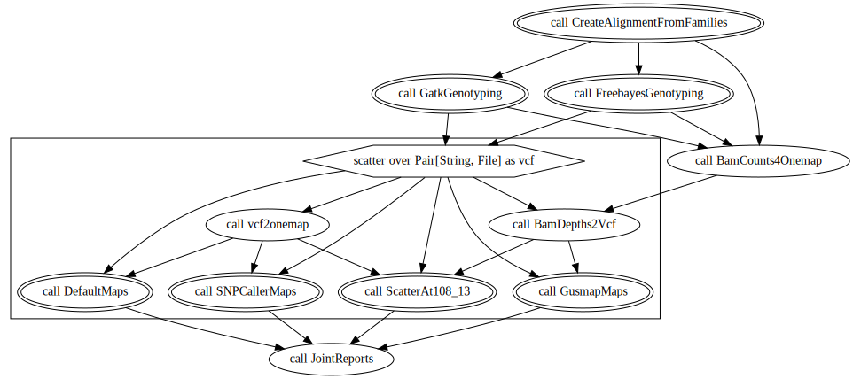
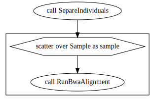
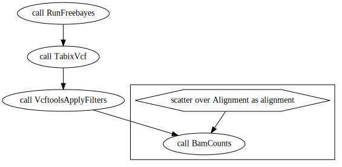
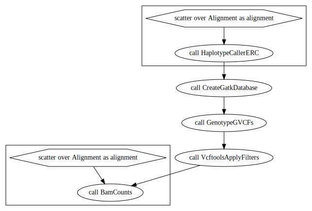
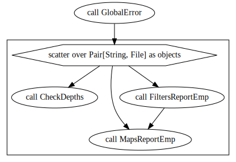
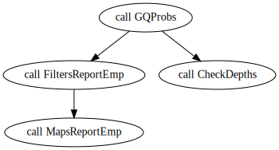
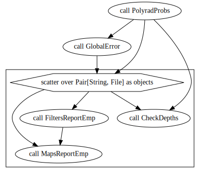
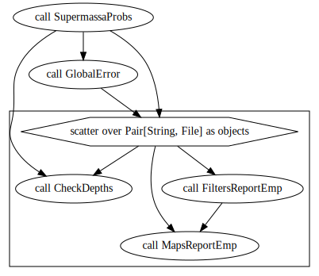
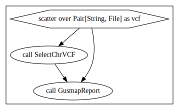

* EmpiricalReads.wdl

This one has as input the demultiplexed and filtered fastq files and the reference genome. The fastq files are aligned to the reference genome, the SNP calling is performed with gatk and freebayes software, the genotype calling is made with updog, polyrad and supermassa software and linkage maps are built with gusmap and onemap.

Sub-workflows are available for each step of the main workflows:

input: reference genome
output: fastq files

* Create_aligments_from_families_files

input: fastq files
output: bam files

* freebayes_genotyping.wdl

input: bam files
output: vcf file

* gatk_genotyping.wdl

input: bam files
output: vcf file

* default_maps.wdl

input: vcf files
output: RData and reports

* SNPCaller_maps.wdl

input: vcf files
output: RData and reports

* polyrad_maps.wdl

input: vcf files
output: RData and reports

* supermassa_maps.wdl

input: vcf files
output: RData and reports

* updog_maps.wdl

input: vcf files
output: RData and reports

* gusmap_maps.wdl

input: vcf files
output: RData and reports

You can also build your own workflow using tasks available in utils.wdl and utilsR.wdl
